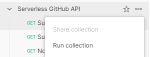
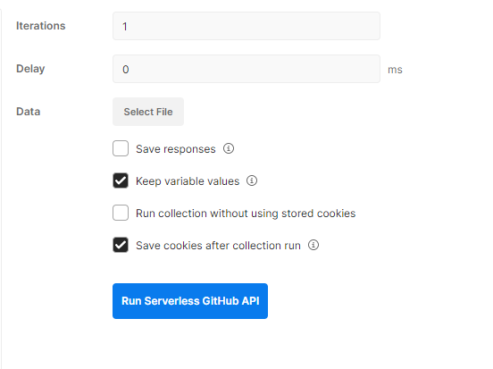

# Serverless GitHub API
A web service that fetches open pull request for a public repository. To fetch open pull request, add the **gitHubRepo** as a **querystringParameters** to the API Endpoint. Examples:

- `GET /github/prs?gitHubRepo=agenda/agenda`
- `GET /github/prs?gitHubRepo=FrontendMasters/bootcamp`


This project has been generated using the `aws-nodejs-typescript` template from the [Serverless framework](https://www.serverless.com/). For detailed instructions, please refer to the [documentation](https://www.serverless.com/framework/docs/providers/aws/).
## Testing remotely

Download [Postman](https://www.postman.com/downloads/) and import the collection for the api.

In Postman, select the collection options and click _Run Collection_. **Important! Do not change the URL which should be vw08kj393c**



Click on the blue button that _Run Serverless GitHub API_.



This will test an exsisting lambda function in the aws cloud.

## Running unit test
[Jest](https://jestjs.io/docs/getting-started) framework to execute unit test.
```
npm run test
```

## Installation/deployment instructions

Download or clone the repository and install the project.

> **Requirements**: NodeJS `lts/fermium (v.14.15.0)`. If using [nvm](https://github.com/nvm-sh/nvm), run `nvm use` to ensure you're using the same Node version in local and in your lambda's runtime. You will need a GitHub Personal Access Token and add it to the .env file AUTH_TOKEN. You will only need the access public repo permission for the access token.

### Project structure

The project code base is mainly located within the `src` folder. The main logic can be found in the [handler.ts](./src/functions//pulls/handler.ts)
 This folder is divided in:

- `functions` - containing code base and configuration for your lambda functions
- `libs` - containing shared code base between your lambdas

```
.
├── src
│   ├── functions               # Lambda configuration and source code folder
│   │   ├── pulls
│   │   │   ├── handler.ts      # `Pulls` lambda source code
│   │   │   ├── axios.ts        # `Pulls` basic axios config
│   │   │   ├── index.ts        # `Pulls` lambda Serverless configuration
│   │   │   ├── mock.json       # `Pulls` lambda input parameter, if any, for local invocation
│   │   │   └── schema.ts       # `Pulls` lambda input event JSON-Schema
│   │   │
│   │   └── index.ts            # Import/export of all lambda configurations
│   │   └── enums.ts            # Static assets used for application data
│   │
│   └── libs                    # Lambda shared code
│       └── apiGateway.ts       # API Gateway specific helpers
│       └── handlerResolver.ts  # Sharable library for resolving lambda handlers
│       └── lambda.ts           # Lambda middleware
│       └── logger.ts           # Exports Winston logger
│
├── package.json
├── serverless.ts               # Serverless service file
├── tsconfig.json               # Typescript compiler configuration
├── tsconfig.paths.json         # Typescript paths
└── webpack.config.js           # Webpack configuration
```

### 3rd party libraries

- [json-schema-to-ts](https://github.com/ThomasAribart/json-schema-to-ts) - uses JSON-Schema definitions used by API Gateway for HTTP request validation to statically generate TypeScript types in your lambda's handler code base
- [middy](https://github.com/middyjs/middy) - middleware engine for Node.Js lambda. This template uses [http-json-body-parser](https://github.com/middyjs/middy/tree/master/packages/http-json-body-parser) to convert API Gateway `event.body` property, originally passed as a stringified JSON, to its corresponding parsed object
- [@serverless/typescript](https://github.com/serverless/typescript) - provides up-to-date TypeScript definitions for your `serverless.ts` service file
